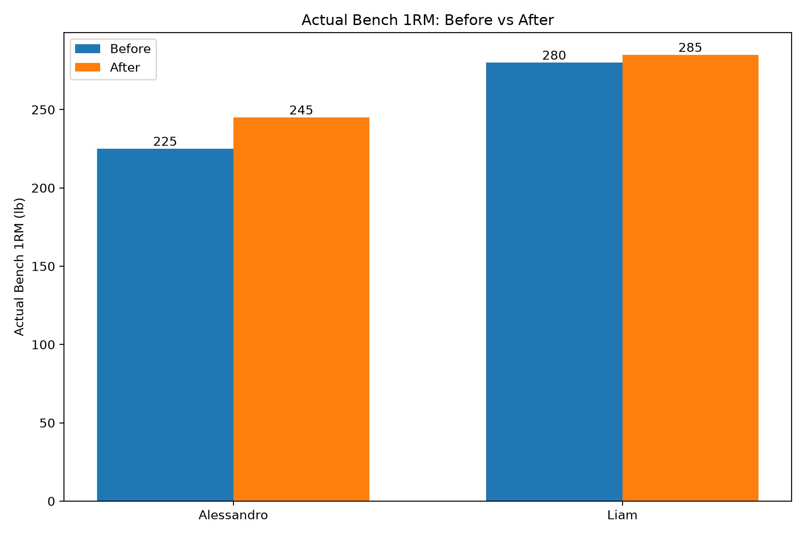
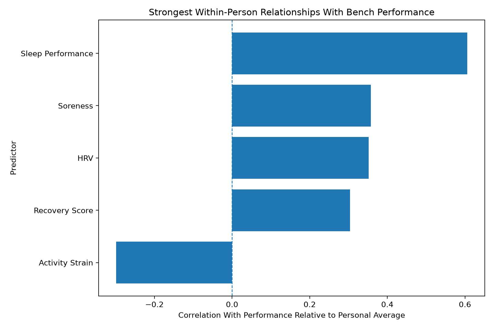
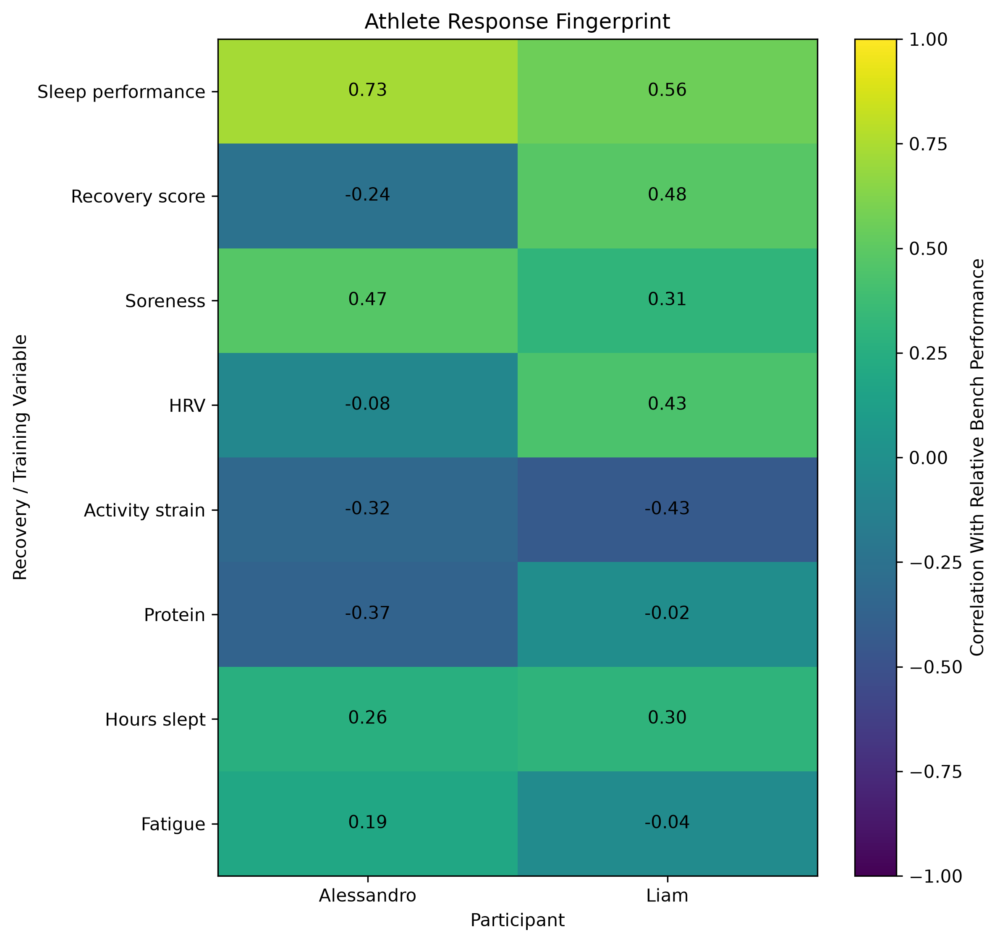
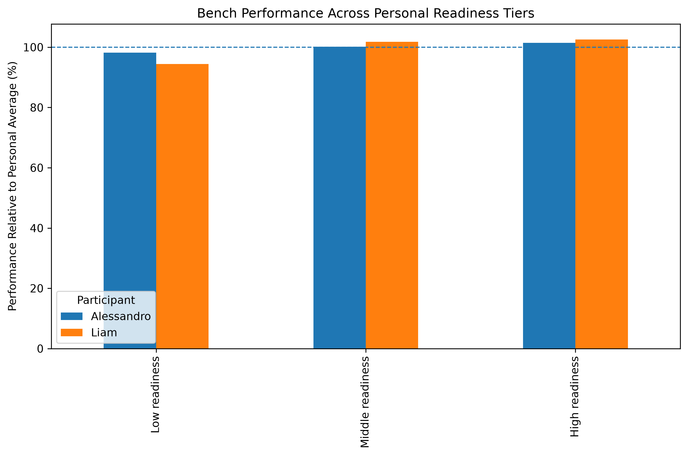
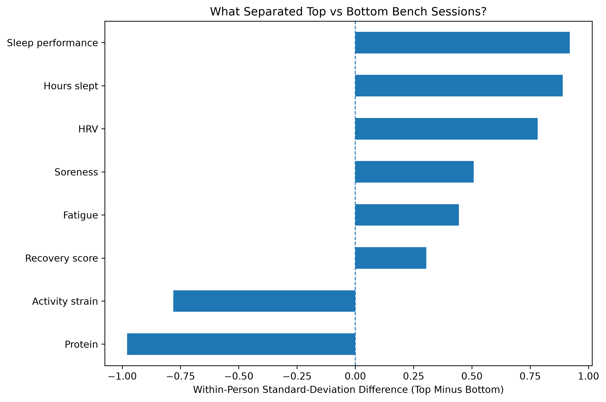

# Bench Press Performance, Recovery, and Physiology

A four-week self-tracking study examining how recovery, sleep, training load, fatigue, and physiology related to bench press performance across two participants.

## Project Goal

This project explored whether day-to-day readiness factors were associated with bench press performance.

Rather than comparing absolute strength between participants, each workout was measured relative to that lifter’s own average estimated 1RM. This made it possible to compare whether a session was above or below that person’s normal performance level.

## Data Collected

### Bench-session data

* Top-set weight and reps
* Estimated 1RM using the Epley formula
* Total bench volume, sets, and reps
* Session type: heavy or volume
* RPE, energy before lifting, and workout quality

### Daily recovery data

* Sleep performance and hours slept
* Recovery score
* HRV and resting heart rate
* Activity strain
* Protein, calories, and hydration
* Fatigue, soreness, and stress

## Tools Used

* **Python:** pandas, NumPy, matplotlib, scikit-learn
* **Tableau Public:** interactive dashboard and visual exploration
* **Google Sheets:** logging, cleaning, and weekly summaries
* **VS Code:** analysis workflow and project development

## Analysis Approach

1. Combined bench-session logs with daily recovery data by participant and date.
2. Calculated estimated 1RM using the Epley formula.
3. Normalized estimated 1RM relative to each participant’s own average.
4. Calculated descriptive statistics, correlations, and simple regressions.
5. Compared individual response patterns between participants.
6. Created a personal readiness index using sleep, recovery, HRV, fatigue, soreness, and activity strain.
7. Compared top-performing bench sessions with bottom-performing sessions.
8. Built an interactive Tableau dashboard for exploratory analysis.

## Key Findings

### Higher readiness was associated with stronger bench sessions

Both participants performed above their personal average on high-readiness days.

| Participant |     Low-readiness sessions |     High-readiness sessions |              Difference |
| ----------- | -------------------------: | --------------------------: | ----------------------: |
| Alessandro  | 98.16% of personal average | 101.48% of personal average | +3.33 percentage points |
| Liam        | 94.44% of personal average | 102.57% of personal average | +8.13 percentage points |

This suggests that the combined readiness score was more informative than looking at only one variable at a time.

### Sleep was the strongest shared performance signal

Sleep performance had the strongest positive relationship with relative bench performance for both participants:

* Alessandro: **r = 0.73**
* Liam: **r = 0.56**

Sessions following better sleep generally tended to be stronger relative to each athlete’s own normal performance.

### Training strain showed a negative relationship for both athletes

Activity strain was negatively associated with relative bench performance:

* Alessandro: **r = -0.32**
* Liam: **r = -0.43**

Higher overall strain was more often associated with below-normal bench performance.

### Individual responses were different

The analysis showed that readiness factors were not equally important for both people.

* Liam showed stronger positive relationships between performance and recovery score (`r = 0.48`) and HRV (`r = 0.43`).
* Alessandro showed a stronger sleep-performance relationship.
* Soreness showed a positive association for both participants, but this should not be interpreted as soreness improving strength. It may reflect training timing, harder sessions, or other factors not measured in the study.

## Visuals

### Actual 1RM: Before vs. After



### Strongest Within-Person Relationships With Bench Performance



### Athlete Response Fingerprint



### Bench Performance Across Personal Readiness Tiers



### What Separated Top vs. Bottom Bench Sessions?



## Tableau Dashboard

The Tableau dashboard includes three interactive visuals:

* **Readiness Bubble Map** — sleep performance, recovery score, relative performance, bench volume, session type, and participant
* **Heavy vs. Volume Session Consistency** — individual-session performance patterns by training style
* **Training Load vs. Fatigue** — how activity strain and fatigue related to bench performance

The Tableau workbook is included as:

```text
Book1.twb
```

## Repository Structure

```text
bench-press-project/
│
├── bench_analysis.py
├── advanced_analysis.py
├── Book1.twb
├── Bench Project - Bench Log.csv
├── Bench Project - Daily Combined.csv
│
├── output/
│   ├── bench_analysis_dataset.csv
│   ├── correlations.csv
│   ├── within_person_correlations.csv
│   ├── athlete_response_fingerprint.csv
│   ├── readiness_tier_summary.csv
│   ├── top_vs_bottom_session_profile.csv
│   └── visuals/
│
└── README.md
```

## How to Run

Install dependencies:

```bash
py -m pip install pandas numpy matplotlib scikit-learn
```

Run the main analysis:

```bash
py bench_analysis.py
```

Run the advanced analysis:

```bash
py advanced_analysis.py
```

Charts, cleaned datasets, correlation outputs, and summary tables are saved in the `output` folder.

## Limitations

* Only two participants were included.
* The study lasted approximately four weeks.
* Several variables were self-reported.
* Estimated 1RM is a performance proxy, not a direct max test.
* Results are exploratory and show associations, not causation.
* These findings should not be generalized to other lifters without a larger sample and longer study period.
